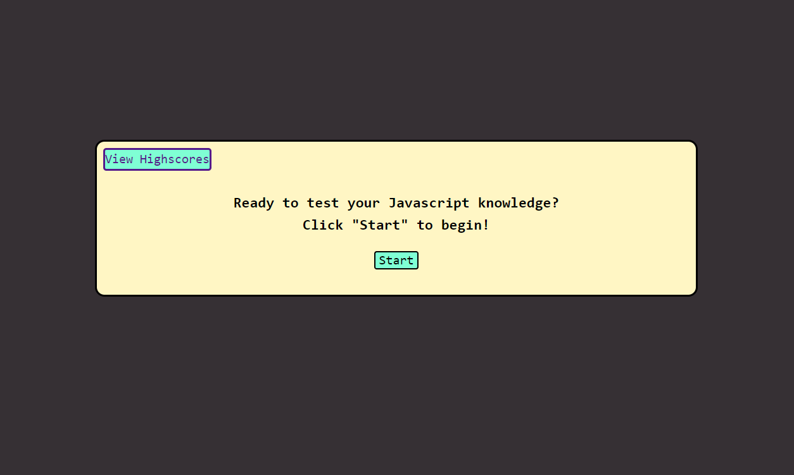

# Challenge 4: Javscript Quiz

## Description

In this challenge I was instructed to build a quiz to test one's knowledge of Javascript. When the user opens the site, they are greeted with a message and a start button. When they click start they are presented with their first question and the timer begins. When the user clicks on an incorrect answer, 5 seconds are deducted from the timer. When they get answer the last question, they are given their score and have the option of saving their score and initials to local storage. They can view their saved scores on the "highscores" page linked at the top of the quiz window. Completing this project helped me better understand how to make functions to solve a problem, and how multiple functions and variables work in relation to one another to make the project execute smoothly.

## Image

## Deployed Website

<a href="https://pinkywiththebrain.github.io/javascriptquiz-challenge-4.2/">Javascript Quiz</a>